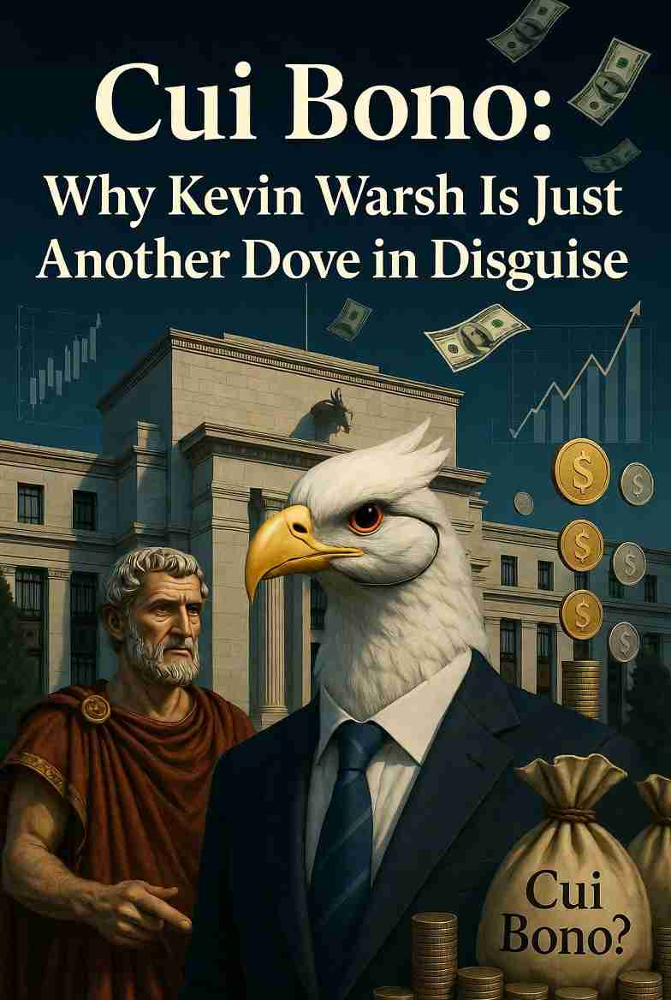

**Cui Bono：為何凱文·沃什只是另一隻偽裝的鴿子**

::: {style="float: left; margin-right: 15px;"}
{width="250px"} 
:::

讓我們從古羅馬的一則小故事開始。當一位元老院議員在廣場上被發現遇刺身亡時，偉大的演說家西塞羅會向群眾提問：「Cui bono?」- 這對誰有利？誰是受益者？這個簡單的問題往往比任何調查都更快揭開真相。兩千年後的今天，同一提問依然跟燈塔的光芒一樣，引導我們明白現代貨幣政策的底蘊。利益分配 - 而非新聞發布會上的華麗但空洞的詞藻 - 才真正揭示人類行為的背後真相。

**公理 1：Cui bono - 這對誰有利？**

這是我在這些文章中將經常運用的第一原則。利益激勵不僅包括物質上的豐厚薪酬和獎金，還包括「感覺良好」和「做正確的事」的心理滿足感。

2026 年 6 月 17 日，凱文·沃什作為新任聯儲局主席舉行了首次記者會。他鄭重宣示致力於恢復物價穩定。最近2026年5月的通膨數據年增率升至4.2%，是三年多高位，主要受地緣政治衝突引發的能源價格暴漲所推動。然而，聯儲局卻決定維持利率不變。

評論家們讚歎道：「沃什不一樣！他是真正的鷹派！」

但我不敢苟同。

讓我們用利益激勵因素來分析吧。川普總統是低利率的愛好者。他公開宣稱：「我愛通膨……那些數字很棒。你知道我真正愛什麼嗎？我愛通膨。」因為鮑威爾不肯積極大幅降息，川普猛烈抨擊前主席鮑威爾行動太慢、是「徹底的失敗者」和不懂變通。他把鮑威爾趕走，正是因為這位前主席不願在中期選舉前用寬鬆貨幣政策刺激經濟。

川普會任命一位真正的抗通膨戰士，甘冒經濟放緩風險而大幅加息的人做聯儲局主席嗎？當然不會。沃什得到這個職位，正是因為他會迎合川普的偏好。他只是表面強硬，但實際上會推行寬鬆貨幣政策。

想真正擊敗通膨，需要提高利率並減少印鈔。就這麼簡單。但沃什卻以能源供應衝擊、AI可帶來的生產力大幅提升，以及「需要更多證據」或更好數據作為藉口，宣布成立多個工作小組來「檢討」聯儲局溝通方式、資產負債表、通膨框架等等典型的官僚拖延戰術，繼續量寛政策。

若沃什大幅推升聯邦基金利率，將會讓美國龐大國債的利息支出爆炸性增長。目前淨利息支付已消耗聯邦收入的約18–22%。利率若再升高，這 - 負擔可能膨脹至收入的25%以上，排擠其他所有支出。在政治和財政上，這無異於自殺。因此，最有可能的政策方向是寬鬆。

沃什或許會小幅加息，以對抗持續走高的通膨，但實質利率幾乎肯定仍會維持負值。更重要的是，一旦出現任何經濟麻煩的跡象- 股市下挫、就業數據下滑，或是來自白宮的政治壓力 - 他就會立刻煞車，毫不猶豫地降息。畢竟，關鍵時刻，利益高於一切。

被視為鷹派沃什的首次亮相（點陣圖亦暗示可能升息），最初確實支撐了美元並壓低股市 - 標普500指數當天下跌超過1%，成為數十年來新主席首次聯邦公開市場委員會會議日表現最差之一。黃金與白銀則在恐慌中被壓低至接近200日移動平均線附近。但如果這種鷹派姿態只是表演，劇本就很清楚了：貨幣將持續貶值、美元長期走弱，以及貴金屬作為可靠避風港會繼續上漲。

投資者應考慮黃金和白銀等硬資產，作為對抗長期貨幣貶值的保護。目前兩種金屬在賣壓後正測試其200日移動平均線，這可能是一個好的買入機會。

這篇文章也已發佈在[我的Substack網站](https://alandharma.substack.com/)上

**免責聲明** 

本部落格所提供之內容僅供資訊與教育用途，並不構成任何財務、投資或專業建議。本人並非持牌財務顧問；文中所表達之觀點僅屬個人基於邏輯思考與一般觀察所得的意見。金融市場本質上具有高度波動性與不可預測性，過往表現並不代表未來結果。

強烈建議讀者在作出任何投資或財務決策前，應自行進行獨立研究、充分的調查分析，並諮詢合格的專業人士。透過存取及使用本部落格的資料，您即承認並同意作者對於因依賴此處所載資訊而可能導致的任何損失、損害或不利結果，概不承擔任何責任或義務。
