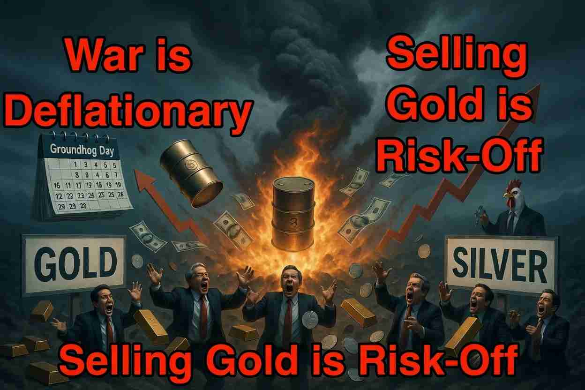

**Monetary Doublethink: War Is Peace, Gold Is Trash**

::: {style="float: left; margin-right: 15px;"}
{width="250px"} 
:::

In George Orwell’s 1949 novel *1984*, the Oceania Government forces citizens into Doublethink: the ability to hold two contradictory beliefs at the same time and accept both as true. “War is Peace.” “Freedom is Slavery.” “Ignorance is Strength.” The goal is not mere compliance, but genuine belief. People must *feel* the slogans as reality, even as the evidence screams otherwise.

Fast-forward to 2026, the financial markets have perfected their own version of Monetary Doublethink: “War is Deflationary”, “Selling gold is risk-off”,  “Bad economic data is bullish for stocks” …  Investors recite these lines with solemn conviction, as evidenced by gold and silver performing the opposite of what every history book, every textbook, and common sense would predict.

Watch the pattern. President Trump threatens to bomb Iranian bridges, power plants, or oil infrastructure. Markets panic over oil shocks. Crude spikes. Inflation fears reignite. Traders pile into rate-hike bets. Gold and silver get dumped. The next day or two, Trump “TACOs” (Trump Always Chickens Out, the Wall Street acronym for his well-documented habit of issuing maximalist threats and then walking them back). Talks resume. Oil softens. Rate fears ease. The metals claw back some of the losses. Then the loop resets. We have been stuck in this cycle for months, like Bill Murray in the movie “Groundhog Day”.

The official explanation sounds logical. Escalation raises the risk of higher energy prices, which would push CPI higher, which would force the Fed to hike rates. Gold pays no yield. Higher dollar yields raise its opportunity cost. Therefore gold falls in dollar terms. Silver, more industrial and more volatile, falls harder. When the TACO arrives and the threat of sustained oil spikes recedes, the metals recover. Perfect.

But war is inflationary. Always has been. Wars destroy supply, divert resources, expand deficits, and usually end in money printing. Look at the data. World War I produced inflation that more than doubled prices in the United States and far worse in Europe. World War II brought shortages, rationing, and a postwar surge that saw U.S. prices jump more than 20% in a single year once controls were lifted. The Vietnam War, financed by deficits rather than taxes, helped fuel the Great Inflation of the 1970s. The 1973 Yom Kippur War and subsequent oil embargo quadrupled crude prices and locked in a decade of stagflation. Even the more limited Gulf War of 1990–91 delivered an oil spike and a measurable inflation jump. Financial indices going back more than a century show the same pattern: wars and the threat of wars reliably foreshadow higher military spending, higher debt, currency debasement, and therefore higher inflation!

Yet here we are, treating war as deflationary rather than a structural inflationary force. In the world of money and politics, one sometimes needs the perspective of a lunatic to make sense of the collective madness. The crowd is selling the very asset that has historically protected purchasing power when governments go to war and print the difference.

Investors who treat the current war as harmful to gold and silver are making a big mistake. Clever capital profits precisely by positioning against the crowd’s erroneous assumption. The metals have already paid the price for the “rate-hike fear” narrative. Silver has roughly halved from its January 2026 all-time high of $121 per ounce. Gold has surrendered about a quarter to a third of its value from the peak around $5,500. Yet the underlying drivers - persistent deficits, central-bank buying, industrial demand for silver, and the long-term erosion of fiat purchasing power - remain intact.

When the shooting finally stops, or when the market finally understands that wars are inflationary rather than deflationary, the metals should reprice higher. 

War inflates. Gold and silver protect. Everything else is Doublethink.

This article has also been published on [my Substack site](https://alandharma.substack.com/).

**Disclaimer:** 

The content provided on this blog is for informational and educational purposes only and does not constitute financial, investment, or professional advice. I am not a licensed financial advisor; the views expressed are solely my personal opinions based on logic and general observations. Financial markets are inherently volatile and unpredictable, and past performance is not indicative of future results.

Readers are strongly encouraged to conduct independent research, perform thorough due diligence, and consult with qualified professionals before making any investment or financial decisions. By accessing and using this blog, you acknowledge and agree that the author bears no responsibility or liability for any losses, damages, or adverse outcomes that may result from reliance on the information presented herein.