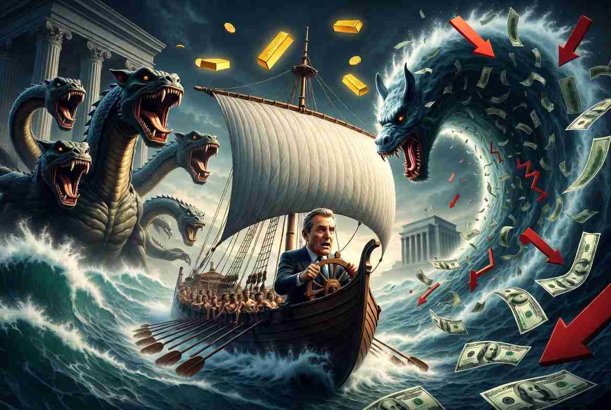

**Between Scylla and Charybdis: Kevin Warsh’s Impossible Choice**

**Why the Fed chairman has no good options left, and why gold wins either way**

::: {style="float: left; margin-right: 15px;"}
{width="250px"} 
:::

In Homer’s *Odyssey*, the hero Odysseus must sail his ship through a narrow strait guarded by two mortal dangers. On one side lurks Scylla, a six-headed monster that snatches sailors from the deck. On the other spins Charybdis, a giant whirlpool that can swallow the entire vessel. Circe advises him to steer closer to Scylla and sacrifice a few men rather than risk losing everything to the whirlpool. Odysseus reluctantly complies. Six crew members die. The ship survives.

Kevin Warsh, the new Federal Reserve chairman, finds himself in the same strait. On one side: raise interest rates aggressively enough to crush inflation. On the other: keep rates low (or raise them only modestly) and let inflation continue to erode the currency. There is no clean passage. Both paths inflict damage. The only question is which damage he is willing to accept.

The straightforward remedy for inflation has always been higher rates. Higher rates cool demand, strengthen the dollar, and eventually bring prices under control. But the United States is no longer a country that can afford the classic cure. Gross national debt stands near USD 39.8 trillion and is on track to cross USD 40 trillion within months. Annual deficits are running close to USD 1.9 trillion this fiscal year and show little sign of shrinking. Social Security and Medicare alone consume enormous shares of the federal budget: Social Security roughly 22–23 percent of outlays and Medicare another 14–17 percent, with net interest payments now rivaling or exceeding defense spending and climbing past USD 1 trillion a year. These programs are politically untouchable, especially with midterm elections approaching. Cutting them would be electoral suicide.

A rate hike would also hammer the stock market. The U.S. economy is heavily consumption-driven, and household wealth (and the confidence that fuels spending) is tied tightly to equity prices. Capital-gains and related tax receipts form a meaningful portion of federal revenue. A sustained market decline would shrink those receipts just as interest costs rise - an ugly combination that further worsens the fiscal situation.

Then there is the bond market, the true elephant in the room. The stock market may capture the headlines, but the Treasury market is where the government actually funds itself. Outstanding Treasury debt already exceed USD30 trillion; the broader U.S. bond market is larger still. A rise in long-term yields threatens the entire financing mechanism of the state. When the 10-year Treasury yield climbed from about 3.97 percent in late February 2026 to the mid-4.6 percent range and beyond, borrowing costs for the government (and for everyone else) rose materially. If Warsh raises rates sufficiently high enough to kill inflation, it will cause a deflationary collapse that is politically and economically unacceptable at current debt-to-GDP ratios. Falling prices and incomes would raise the real burden of existing debt, trigger cascading defaults, and risk a self-reinforcing debt-deflation spiral. Governments and central banks will not permit it for long. The historical response to such threats has been aggressive liquidity provision, fiscal stimulus, and monetary expansion - precisely the environment in which gold has thrived.

Warsh has little genuine choice. Like previous chairpersons, he must continue to do the unsustainable in order to sustain the unsustainable for a while longer. In a world of nearly USD40 trillion in debt, structurally large deficits, and politically sacred entitlement programs, the path of least immediate resistance is the one that tolerates higher inflation and a softer dollar.

Warsh, like Odysseus, appears to have chosen the less catastrophic path: sacrifice a few sailors (accept higher inflation and a weaker dollar) rather than risk the entire ship (a bond-market revolt that forces yield-curve control or worse). 

At his recent press conference he talked tough about price stability, then left rates unchanged. The market’s response was telling - the 10-year yield pushed higher and the 30-year approached or exceeded 5.2 percent. Debt vigilantes read the decision as a signal that the Fed will ultimately prioritize financial stability and fiscal arithmetic over disinflation.

We are watching a modern Odysseus choose which sailors to feed to the monster. The ship may limp through the strait. The passengers holding real assets rather than paper promises are the ones most likely to reach the other side intact.

This article has also been published on [my Substack site](https://alandharma.substack.com/).

**Disclaimer:** 

The content provided on this blog is for informational and educational purposes only and does not constitute financial, investment, or professional advice. I am not a licensed financial advisor; the views expressed are solely my personal opinions based on logic and general observations. Financial markets are inherently volatile and unpredictable, and past performance is not indicative of future results.

Readers are strongly encouraged to conduct independent research, perform thorough due diligence, and consult with qualified professionals before making any investment or financial decisions. By accessing and using this blog, you acknowledge and agree that the author bears no responsibility or liability for any losses, damages, or adverse outcomes that may result from reliance on the information presented herein.