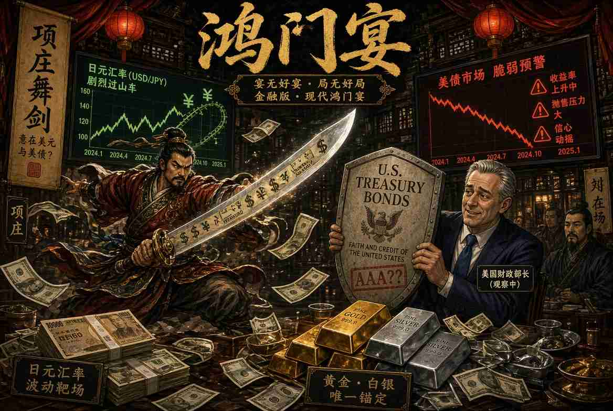

**项庄舞剑：贝森特真正在保卫的是日圆吗？**

**官方说法是援助盟友。真正的诱因，是防止美国国债市场出现失控式抛售。**

::: {style="float: left; margin-right: 15px;"}
{width="250px"} 
:::

秦朝末年，各路起义军中，刘邦与项羽的势力最为强大。双方曾约定：谁先攻下秦都咸阳，谁就在关中称王。结果刘邦先入咸阳，项羽大怒。

项羽的远房叔父项伯，与刘邦的谋士张良交情甚笃。听到消息后，项伯连夜赶去警告张良，劝他赶紧逃走。张良不愿抛弃主公，反而引荐刘邦与项伯相见。刘邦热情接待，并与项伯结为儿女亲家。项伯于是劝刘邦亲自前往向项羽解释、道歉。

翌日，刘邦率随从抵达鸿门。项羽的首席谋士范增力劝主公在宴席上除掉刘邦，并埋伏武士，约定项羽举杯为号即动手。

宴席上，刘邦态度谦卑、极尽奉承。项羽性情直爽，渐渐被安抚，不再有杀意，对范增多次示意皆视而不见。范增见计谋难成，便找来项羽的堂弟项庄，说：「大王太仁慈了。你进去以舞剑助兴为名，趁机杀了刘邦。」

项庄入席敬酒后，请求舞剑。剑光闪动，越舞越靠近刘邦。项伯见状着急，起身说：「一人独舞兴致不高，让我来对舞吧！」随即拔剑起舞，暗中以身体挡在刘邦身前，使项庄无法下手。

张良见情况危急，赶忙出去对刘邦的猛将樊哙说：「现在项庄拔剑起舞，他的用意就是要杀沛公啊！」这正是《史记》名句「今者项庄拔剑舞，其意常在沛公也」的由来。樊哙立即持武器闯入宴席。在张良与樊哙的保护下，刘邦最终找到机会离开，安全返回自己的军营。

这就是历史上著名的「鸿门宴」。

时光快转两千多年，场景换到华盛顿与东京。

美国财政部长斯科特•贝森特（Scott Bessent）刚刚与日本联手，罕见地进行协调干预，以支撑持续暴跌的日圆。官方说法是盟友之间的团结之举。日圆已跌至数十年低点，逼近1美元兑164日圆，为自1980年代中期以来最弱。日圆此前处于无序贬值状态，进口通胀（尤其是能源与民生必需品）上升，东京担心日圆贬值陷入死亡螺旋。

表面上看，华盛顿的协助显得慷慨。但若进一步以「诱因是塑造人类行为最强力的力量」这条公理来分析，整出戏就像极了项庄舞剑：表面表演是一回事，真正的目标却是另一回事。

干预真正的目标，是防止美国国债出现失控式抛售。

日本是美国国债最大的外国持有者，帐上约持有1.14至1.2兆美元。若东京为了捍卫日圆而大量抛售这些国债，将在美国长期殖利率本已敏感的时刻，进一步推高殖利率。贝森特绝不会让这种情况发生。

干预日圆的逻辑十分明显。日圆贬值会把通膨输入日本。要支撑汇率，东京的选择有限。若积极加息，将推高日本政府公债殖利率。日本债务对GDP比率超过200%，殖利率急升可能引发经济衰退，并导致庞大的日圆套利交易（yen carry trade）无序平仓。

所谓日圆套利交易，是指借入低息日圆，投资于其他高收益资产，估计规模从数千亿美元到数兆美元不等（若计入杠杆与不列入资产负债表的部份）。日圆若突然大幅升值，这些套利交易就被迫平仓，投资者必须卖掉外国资产（包括美国国债）来偿还日圆借款，这是华盛顿最不想见到的情况。 

日本的另一选择是卖出自己拥有的美国国债换取美元，再用美元买入日圆。贝森特不允许这种情况发生，因此他推动扩大联准会的「外国与国际货币当局回购机制」（FIMA Repo Facility）——目前每个交易对手每日上限为600亿美元——让日本能以国债作为抵押借入美元进行干预，而不必抛售美国债券。

在最近这次行动中，美国更进一步选择卖出欧元（而非美元）来买入日圆。若卖出美元，将与「强势美元」政策相矛盾，并可能进一步推高美国殖利率；卖出欧洲资产则无此顾虑。有报导指出，欧洲中央银行是在交易完成后才被告知——这是违背主要央行之间惯常咨商规范的罕见做法。

市场的即时反应相当戏剧性：日圆在短时间内急涨约5%。日圆升势持续了多久？数日后日圆就回吐相当部分涨幅，回落到1美元兑157至158日圆区间。历史经验显示，这类干预多半只是争取短暂喘息的时间，而非扭转根本趋势。利差、日本的财政轨迹，以及支撑日圆弱势的结构性力量，基本上都还在。若日圆贬值再度加速，将需要更大规模、更频繁的干预。

其他国家与大型机构也因各自理由（外汇储备管理、流动性、收益率等）持有大量美国债务。一旦其中任何一方因为某种需要——例如为了取得美元购买石油——而决定卖出美国国债，同样的压力就会出现。华盛顿不愿看到外国帐户在市场已承压时抛售美国国债，这将迫使贝森特发动越来越多此类干预。而这些干预，本质上不过是用凭空印出的美元，进行变相的收益率曲线控制。

简言之，为了不让美国长期国债殖利率升得太高、太快，贝森特会用尽一切可用方法以及任何必要手段，阻止美国国债泡沫爆破。

债券市场的损失，将被转移到货币层面，也就是我们口袋里的银纸购买力会不断下降。

对投资者而言，自保之路是黄金与白银。

项庄舞剑，嘴上说只是助兴，真正的意图，从来不是助兴。今天也一样，跟着诱因走，真正目的就清楚了。

这篇文章也已发布在[我的Substack网站](https://alandharma.substack.com/)上。

**免责声明** 

本部落格所提供之内容仅供资讯与教育用途，并不构成任何财务、投资或专业建议。本人并非持牌财务顾问；文中所表达之观点仅属个人基于逻辑思考与一般观察所得的意见。金融市场本质上具有高度波动性与不可预测性，过往表现并不代表未来结果。

强烈建议读者在作出任何投资或财务决策前，应自行进行独立研究、充分的调查分析，并咨询合格的专业人士。透过存取及使用本部落格的资料，您即承认并同意作者对于因依赖此处所载资讯而可能导致的任何损失、损害或不利结果，概不承担任何责任或义务。