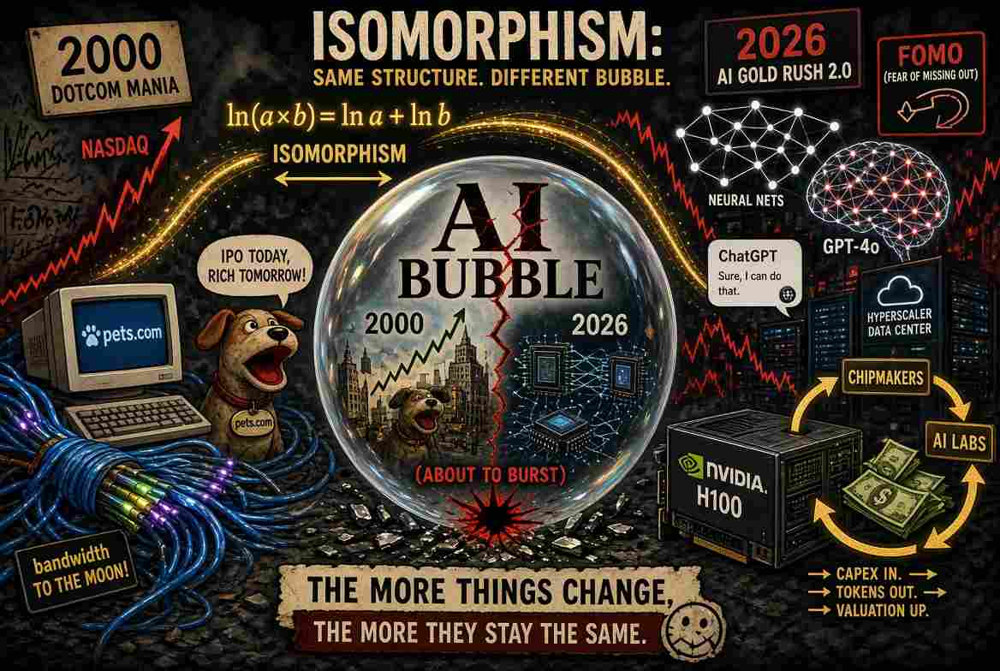

**同構（isomorphism）與即將到來的AI泡沫爆破**

::: {style="float: left; margin-right: 15px;"}
{width="400px"} 
:::

同構（isomorphism）是兩組實體之間一種特殊的映射（mapping）關係，它能完整保留結構。這兩組事物外表看起來不同，內在運作方式卻完全一致。要成為同構，必須滿足三個條件：第一組中的每一個元素都恰好對應第二組中的一個元素，且沒有遺漏；在第一組進行的運算，其結果必須精確對應第二組中的另一種運算；並且存在一個逆映射（inverse mapping），可以把第二組中的運算結果轉化回第一組的運算結果。

自然對數是教科書中的經典同構例子。它把正數的乘法世界，轉變成實數的加法世界。對任意兩個在第一組乘法世界的正數 a 與 b，我們都可用自然對數將它們轉變成第二組加法世界中的 ln a 和 ln b，然後計算$\ln a + \ln b$，因為 $\ln a + \ln b = \ln(a \times b)$，我們可用對數的逆函數（inverse function），即指數函數（exponential或antilogarithm），還原a × b的乘積。

在電子計算機尚未出現的年代，科學家正是靠這個技巧來簡化巨大數字的乘法。他們翻開厚厚的對數表，把噩夢般的乘法變成簡單的加法，算出答案後，再用反對數（anti-log，也就是把總和轉回乘積的逆函數）換算回去。結構保持完整，只是算術變得不那麼令人畏懼。

同構在許多領域都有重要的應用。例如，在垃圾郵件過濾器中，演算法會根據電子郵件所包含的個別單字，計算該郵件為垃圾郵件的機率:

$P(\text{Spam}\mid \text{words})\propto P(\text{Spam})\times P(\text{word}_{1}\mid \text{Spam})\times P(\text{word}_{2}\mid \text{Spam})\times \dots \times P(\text{word}_{n}\mid \text{Spam})$ 

在上述公式中，words = {word1, word2, …, wordn} 是經過移除停用詞(stop words)後，該電子郵件所包含的單字集合。P(Spam|words) 是在已知郵件包含這些單字的條件下，該郵件為垃圾郵件的後驗機率(Posterior Probability)。P(Spam|words) 與 P(Spam)（即郵件為垃圾郵件的先驗機率 Prior Probability）以及各個單字的似然機率(Likelihood Probability)的乘積成正比。因此，計算 P(Spam|words) 涉及將介於 0 與 1 之間的機率數字相乘。只要相乘的次數夠多，乘積就會急速趨近於零，超出處理器浮點暫存器可存儲的範圍，電腦於是把結果寫成零，垃圾郵件過濾器就此中斷。解決方法就是把整個乘數全部通過自然對數變成加數，也就是我們前面描述的做法。

像$\ln 10^{-5} \approx -11.51$這樣的數字完全穩定。把數百個這樣的數字加起來，只會得到一個大的負數，硬體可以毫不費力地儲存。

由於同構能保留結構，在一個領域被證明的任何定理，幾乎可以機械式地轉換到另一個領域。正因如此，同構可以用來分析 1999–2000 年的網路泡沫與當前的AI泡沫。這兩個泡沫是同構的：光纖電纜變成了 GPU 叢集，「網路流量每 100 天翻一倍」變成了「AI 將把生產力提升到超乎想像的境界」，但內在邏輯完全相同。因此，從第一個泡沫發展出的每一個理論，都可以原封不動地搬到第二個泡沫，無須重新證明。

在兩場狂熱中，投資人都拋棄了獨立思考，怕執輸不理估值是否合理就投入大量資金。網路泡沫年代，那些只有一個網站的虧損新創公司也獲得數十億美元的估值。Pets.com、Webvan 以及數十家同類公司，全靠一個不知可否賺錢的概念就起飛。今天，同樣的模式在AI公司以及支持它們的超大規模雲端業者身上重現。領先模型公司的估值已攀升至數千億美元。市場給予晶片製造商 - Nvidia、Broadcom、Micron、AMD、ASML、TSMC - 超高的PE：Nvidia 約 33 倍，Broadcom 45–60 倍，AMD超過 80 倍，ASML 50 倍以上。以目前價格買下整組AI公司股票，回本期要數十年之久，這與 2000 年初那些同樣天價PE的纜線與伺服器公司一樣。

高估值支持更高的資本支出，而資本支出又可支撐更高估值的股價。高盛預測，超大規模業者的AI資本支出到 2027 年可能接近 1.4 兆美元。企業投入以兆美元計的資金，但迄今回報卻相當微薄。麻省理工學院媒體實驗室的一項研究（Project NANDA，《The GenAI Divide: State of AI in Business 2025》）檢視了數百個企業計畫後得出結論：儘管投入了數百億美元，95% 的組織在生成式人工智能投資上獲得的回報為零。這種模式在網路泡沫時期同樣出現：「眼球數」與「頁面瀏覽量」被當成未來獲利的領先指標，但對大多數公司而言，那些利潤從未實現。

願意付費的用戶人數偏低。OpenAI 自己披露，ChatGPT 已達到約 8 億用戶，但只有大約 5,000 萬人 - 僅略超過 6% - 是付費用戶。1990 年代末期，同樣的現象出現在免費電子郵件服務、內容入口網站與早期電子商務網站：用戶數龐大，實際營業額卻微不足道。

創意會計與循環融資進一步把這兩個泡沫的同構關係顯示得更完整。Nvidia 已成為一張相互關聯交易網的中心齒輪：它對AI實驗室與雲端供應商進行股權投資，後者隨後承諾大量採購 Nvidia 晶片，或租用 Nvidia 驅動的運算系統。資金循環來回，營業額被人為提升，進而強化「需求不可阻擋」的故事。思科與其他網路設備商在 1999–2000 年也曾玩弄類似手法，向客戶提供慷慨的供應商融資，讓客戶再去購買更多思科設備。當音樂停止時，許多應收帳款最終變成了壞帳。

沒有人能精準預測爆破的時刻。網路泡沫經歷大約兩年的顛峰狂熱期（1998–2000）膨脹，接著在之後的兩年半崩塌，納斯達克指數在十四年後才收復失地。AI泡沫會同一下場嗎？

這篇文章也已發佈在[我的Substack網站](https://alandharma.substack.com/)上

**免責聲明** 

本部落格所提供之內容僅供資訊與教育用途，並不構成任何財務、投資或專業建議。本人並非持牌財務顧問；文中所表達之觀點僅屬個人基於邏輯思考與一般觀察所得的意見。金融市場本質上具有高度波動性與不可預測性，過往表現並不代表未來結果。

強烈建議讀者在作出任何投資或財務決策前，應自行進行獨立研究、充分的調查分析，並諮詢合格的專業人士。透過存取及使用本部落格的資料，您即承認並同意作者對於因依賴此處所載資訊而可能導致的任何損失、損害或不利結果，概不承擔任何責任或義務。
