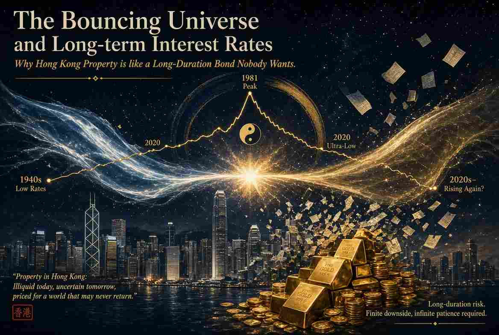
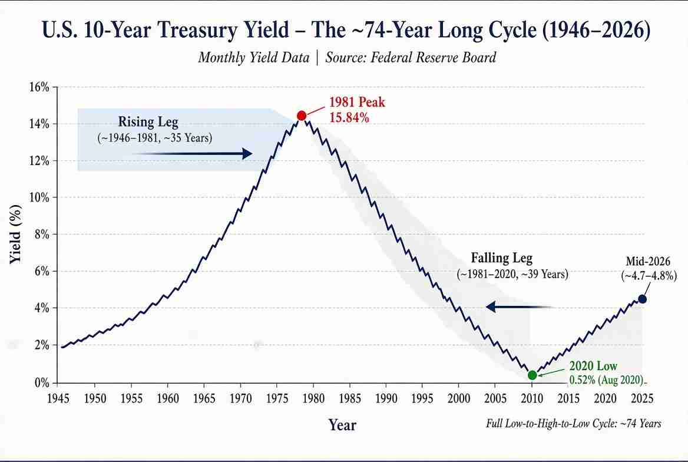

**弹跳宇宙与长期利率**

**为何香港砖头已变成无人想持有的长期债券**

::: {style="float: left; margin-right: 15px;"}
{width="400px"} 
:::

科学界普遍认同的宇宙论是「大爆炸」加上ΛCDM（Lambda冷暗物质）再加上「暴胀」。很久很久以前，整个宇宙被压缩成一个极微小的奇点（Singularity）。某天这个奇点「砰」的一声爆炸，宇宙开始膨胀。它至今仍在膨胀，而且因为一种神秘的被称为Lambda（Λ）的暗能量（Dark Energy）令膨胀加速得更快。如果没有暗能量，宇宙的膨胀本应在重力拉扯下逐渐减速。冷暗物质（CDM）是一种非重子物质，移动速度远慢于光速，它在重力作用下聚集，形成星系结构的「骨架」。而暴胀则是早期一段极其迅速的膨胀，把宇宙熨得平坦而光滑。

还有另一派宇宙理论：循环或振荡模型。在这些模型里，宇宙并非始于一次大爆炸，然后无限膨胀。它会膨胀、收缩（或「弹跳」），然后再膨胀 - 可能永远如此。每个周期可长达数万亿年。最著名的现代版本是Steinhardt–Turok循环／火劫模型，它假设存在两张巨大的宇宙「膜」（branes），漂浮在高维空间中。它们缓慢靠近，温和碰撞后再弹开。每次碰撞就是一次新的「大爆炸」。碰撞前有一段漫长、极缓慢、极平滑的收缩过程，称为「火劫」（ekpyrosis）。这段缓慢挤压过程把宇宙「熨」得平坦。

弹跳宇宙理论与中国传统思想十分吻合。中国人向来视宇宙为永恒的循环 - 透过不断的转化循环自我更新。古代典籍《十大经》概括道：「极而反，盛而衰，天地之道也，人之理也。」老子说得更直接：「反者道之动。」换句话说，当钟摆往一方摆动时，它同时在储蓄能量，准备往相反方向回摆；到了最高点，必然转向。

长期利率（见下图）也遵循同样的节奏。 10年期美国国债收益率从1940年代中期战后低点约1.5%，一路攀升至1981年9月的15.84% - 大约35年的上升周期。随后它又下跌了39年，于2020年8月触及历史低点0.52%。从低到高再回低，整整约74年。每个主要腿期持续35至40年。 30年期国债情況类似：2020年接近1%的低点后，近期已升至约5.2%。

::: {style="float: left; margin-right: 15px;"}

:::

我认为主要利率趋势现已向上。美国联邦总债务已突破40万亿美元。即使在经济扩张时期，政府仍年年出现数万亿美元赤字。一旦债务大到无法用真金白银偿还，联储局的首要任务就变成防止债券市场崩盘。政治上唯一可行的工具只剩下某种形式的殖利率曲线控制，用新印的钱买债券或压制收益率，避免长期利率升得太高而引爆利息成本。这就是变相的金融压抑。

债权人并不傻。外国央行多年来一直在减持美债。购买长期债券的投资者需要相信通胀会被控制住。一旦开始怀疑，他们就会要求更高的收益率。

债券在过去六年多已成死亡陷阱，未来看来仍是如此。收益率升得越高，价格跌得越深。

房地产的逻辑一样。利率上升提高按揭成本、推高投资者要求的资本化率，从而降低未来租金的现值。成交量放缓、发展停滞、价格向下调整。商业地产（写字楼、零售店）本已面临遥距工作与电子商务的结构性逆风，更高利率只是雪上加霜。住宅市场相对有韧性，因为人仍需要住处、供应往往受限，但随着利率上升，新买家的负担能力会变得极其严峻。

香港是极端案例。根据最新《国际住房负担能力报告》（Demographia），中位数楼价对收入倍数仍达14.1 - 意味着一个家庭必须把全部收入连续14.1年完全不吃不喝、不坐车、不消费，才能买到一套中位价单位。香港已连续十六年蝉联全球主要城市中最难以负担的住房市场。即使经历了从2021年高峰（倍数一度达23.2）的多年调整，香港仍属「严重难以负担」级别。逐渐攀升的利率只会让情况变得更差。

你或许会说：政府印钱来稀释巨额债务，也会同时推高楼价，因此若以现金全款买楼、不借按揭，房地产仍能保值。然而当同样的楼价用硬尺度 - 黄金 - 来衡量时，画面便截然不同。

看看香港住宅市场。差饷物业估价署的私人住宅售价指数（1999年＝100）在2021年攀至约393的高峰。到2024年底至2025年，已跌至约280至290出头 - 名义跌幅约25–28%。即使2025–2026年有部分反弹，价格仍远低于2021年高位。

同期黄金已不止翻倍。物业高峰时每盎司约1,800–2,000美元的金价，如今已升至4,300–4,600美元以上。换句话说，买一套单位所需的港元数量只温和下跌，但所需的黄金盎司数量却大幅减少。以真实、无法印刷的黄金衡量，香港住宅物业已明显变得更便宜。

再拉长时间轴。 2000年，一套中档地区800平方呎的单位可能成交价约400万港元。当时金价约每金衡盎司2,000港元，这套单位约值2,000盎司黄金。

今天同一单位名义价格可能约值1,000万港元。然而金价已升至每盎司约32,000–35,000港元。以黄金计算，这套单位现在只值约280–310盎司 - 实质下跌超过八成。

简言之，名义香港楼价经历了数十年牛市。但以无法被印刷的黄金衡量，一套普通单位的真实购买力，远低于千禧年之初。

租金回报也毫不吸引。香港住宅物业毛租金回报率目前约3.3–3.6%。扣除管理费、差饷、维修与空置成本后，净回报往往跌至2%或以下。为何要为砖头的麻烦、不流动性与杠杆风险，只换取约2%的回报，而无风险的10年期美国国债却能给你约4.7%？

老子在《道德经》第七十七章说：「天之道，损有余而补不足。」在香港楼市，过高的一直是估值、杠杆，以及「楼价只会升」的顽固信念。当前的调整，不过是「道」在运行。如果长期利率周期继续与历史押韵，收益率的主趋势向上，即使上升周期只大致相当于前两次（三十至四十年），也足以持续对债券与房地产造成压力。在这样的环境下，持有长期纸债或高杠杆物业，看起来不再是可靠的保值方法，而更像是购买力的必然被侵蚀。

没有人能逆转这个长周期，也没有人能挡住潮水。聪明的资本会顺势而为，而不是逆流而上。

这篇文章也已发布在[我的Substack网站](https://alandharma.substack.com/)上。

**免责声明** 

本部落格所提供之内容仅供资讯与教育用途，并不构成任何财务、投资或专业建议。本人并非持牌财务顾问；文中所表达之观点仅属个人基于逻辑思考与一般观察所得的意见。金融市场本质上具有高度波动性与不可预测性，过往表现并不代表未来结果。

强烈建议读者在作出任何投资或财务决策前，应自行进行独立研究、充分的调查分析，并咨询合格的专业人士。透过存取及使用本部落格的资料，您即承认并同意作者对于因依赖此处所载资讯而可能导致的任何损失、损害或不利结果，概不承担任何责任或义务。