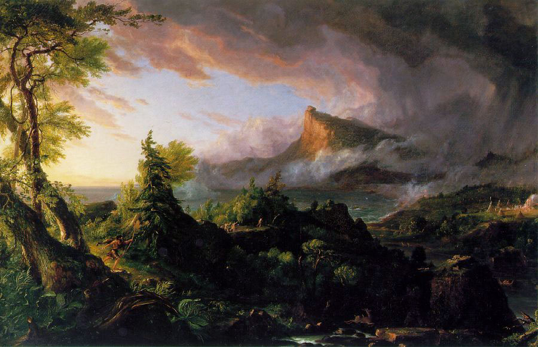
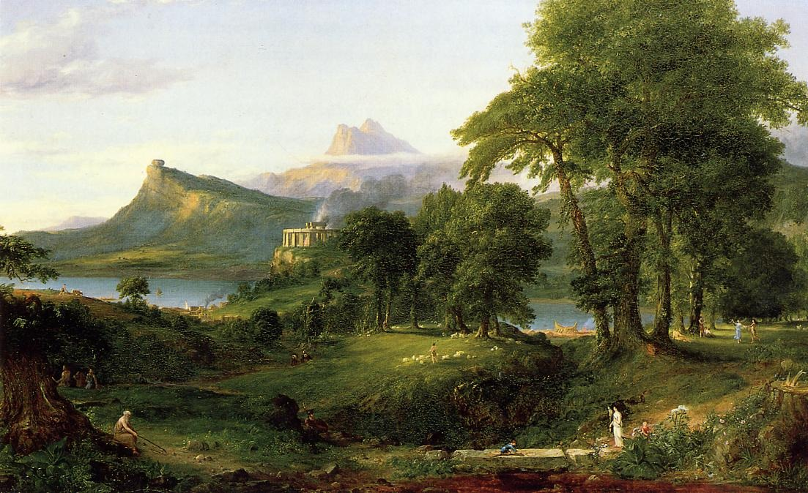
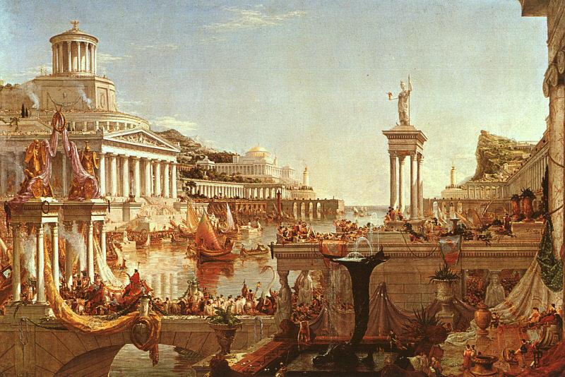
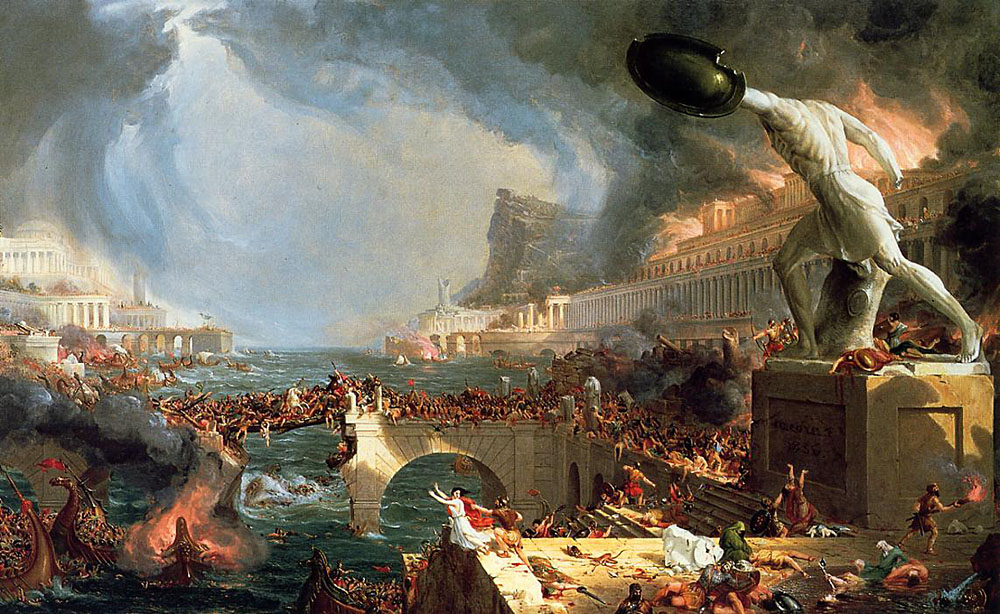
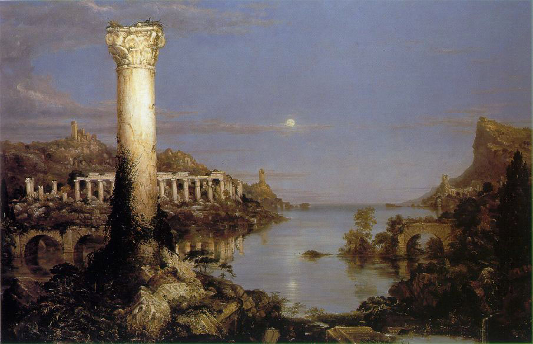

**帝国兴衰之路与霍尔木兹海峡**

**历史不断重演，尤其当帝国忘记如何说「够了」的时候**

汤玛斯·科尔（Thomas Cole）的《帝国兴衰之路》（The Course of Empire，1833–1836）是一套五幅画作，描绘一个虚构文明从兴起至覆灭的完整生命周期。第一幅《野蛮状态》（The Savage State）呈现黎明时分的荒野与原始猎人。我们看到社会的雏形，生活艰苦，人们开始以互利合作让日子好过一点。

(The Savage State by Thomas Cole, https://commons.wikimedia.org/w/index.php?curid=182985)

第二幅《田园牧歌状态》（The Arcadian or Pastoral State）转为平静的田野，牧羊人与早期农业。

(The Arcadian or Pastoral State by Thomas Cole, https://commons.wikimedia.org/w/index.php?curid=182982)

第三幅《盛极的帝国》（The Consummation of Empire）展示帝国辉煌的场景 - 大理石神殿、拥挤的港湾、游行队伍，以及正午阳光下的英雄。

(The Consummation of Empire by Thomas Cole, https://commons.wikimedia.org/w/index.php?curid=183030)

接着是《毁灭》（Destruction）：火焰、外敌入侵、战争与动乱。

(Destruction by Thomas Cole, https://commons.wikimedia.org/w/index.php?curid=183045)

最后一幅《荒凉》（Desolation）显现宁静的黄昏，一切又重新开始。

(Desolation by Thomas Cole, https://commons.wikimedia.org/w/index.php?curid=183020)

只有画中的山在每幅画中都屹立不动，一切每一刻都在变。科尔的讯息很清楚：帝国兴起，因自身成功而变得臃肿，然后倒下。

帝国一个个此起彼落，谁还记得古代吕底亚？还有他们的语言与文化？西元前六世纪，它雄霸安纳托利亚（今小亚细亚）。其国王克罗伊斯（Croesus）据称是当时最富有的人。他的财富来自帕克托鲁斯河（Pactolus，今日土耳其西部的萨尔特恰伊河，位于马尼萨省萨迪斯废墟附近）。传说国王迈达斯（King Midas）曾在这条河中洗去他的「点金诅」- 一个会把他所触碰的一切（包括食物）都变成黄金的诅咒 - 令河床铺满着闪烁的金和银。

对克罗伊斯来说，一切都很顺遂，直到西元前550年。他担心居鲁士大帝领导下的阿契美尼德帝国崛起，挑战他的地位，于是向德尔斐神谕（the Oracle at Delphi）请示是否应先发制人。神谕的隐晦回覆是：「渡过哈里斯河将摧毁一个伟大的帝国。」克罗伊斯一向乐观，以为指被摧毁的是波斯。但实际指的是吕底亚。吕底亚彻底地被摧毁了。

克罗伊斯的埋葬地？无人知晓。他的帝国？噗一声烟消云散了。

罗马走的是同一条道路 - 开始时卑微，其后发展成辉煌的帝国，然后过度扩张，蛮族入侵，最后走向漫长混乱的黄昏岁月。这个模式不断重复。

美国正重复类似的步伐。它在十九世纪以一个诚实、充满活力且相对谦逊的共和国起步。第一次世界大战后取得领先地位。到二十世纪中叶，它已是强大，自豪，且广受敬仰的霸权。如今头发花白、关节酸痛，这位老人却仍坚持自己还是二十五岁。

川普注定要加速美国的衰落。他几乎制裁所有没有按时为他鼓掌的人。盟友因维护自身利益而被他训诫，威胁，和被加征关税。他对格陵兰和加拿大等地区提出突兀、单方面的要求和领土威胁，并用毫无外交体面的语言向外国元首施压。

如今他对伊朗进行攻击，却无法保持霍尔木兹海峡畅通。这一幕与1956年英国的苏伊士运河惨败极为相似。当年埃及总统纳赛尔将苏伊士运河国有化时，英国（联同法国与以色列）发动军事行动试图夺回。入侵在战术上成功，在战略上却彻底失败。美国拒绝支持，英镑承压，国际谴责迫使它屈辱撤军。首相艾登辞职。这一事件向世界宣告：英国已不再是能独当一面的全球霸权。曾经是日不落的大英帝国，太阳明显在落下。

美国无力重新开放霍尔木兹海峡，传达的正是同样的讯息。对亲美的海湾国家而言，驻扎美军基地或依赖美国保护，如今看起来不但不安全，兼且是自找麻烦。美国先前部署的军事设施远未能吓阻对手，反而一再引来报复性攻击。当地机场、港口与城市变成方便的靶子。原本以为安全得到保障，现在却是把关键基础设施、经济建设与平民推上火线。美国能够和愿意确保石油畅通与区域安全的假设已不再可靠，靠近美国看起来愈来愈危险。

海湾的麻烦不会只停留在海湾。所有人都承担被推高的能源价格，其他国家已开始怀疑美国安全承诺的价值。

美国帝国明显过度扩张。数字说明一切。美国仅国防部一年就花费约九千亿美元，超过其后十个国家的总和，却仍无法控制霍尔木兹海峡。它在九一一后的全球反恐战争中已花费超过八兆美元，但圣战恐怖主义仍不断扩散。与此同时，联邦政府的总负债（已拨款与未拨款）超过一百二十兆美元。即使在非衰退年份，年度赤字仍接近两兆美元。税收根本无法覆盖福利计划、现有债务利息与全球军事存在的开支。

随着债务持续攀升，利息成本排挤其他一切开支，印钱是 入不敷支的唯一解决方法。每一轮新的货币量宽，都让人对美国纸币长期价值的信心下降。信心是极其脆弱的东西，我们不该经常去试探它。当它最终破裂时，债券市场就会崩溃，那就是吹笛人来收款的时候了。

这篇文章也已发布在[我的Substack网站](https://alandharma.substack.com/)上。

**免责声明** 

本部落格所提供之内容仅供资讯与教育用途，并不构成任何财务、投资或专业建议。本人并非持牌财务顾问；文中所表达之观点仅属个人基于逻辑思考与一般观察所得的意见。金融市场本质上具有高度波动性与不可预测性，过往表现并不代表未来结果。

强烈建议读者在作出任何投资或财务决策前，应自行进行独立研究、充分的调查分析，并咨询合格的专业人士。透过存取及使用本部落格的资料，您即承认并同意作者对于因依赖此处所载资讯而可能导致的任何损失、损害或不利结果，概不承担任何责任或义务。