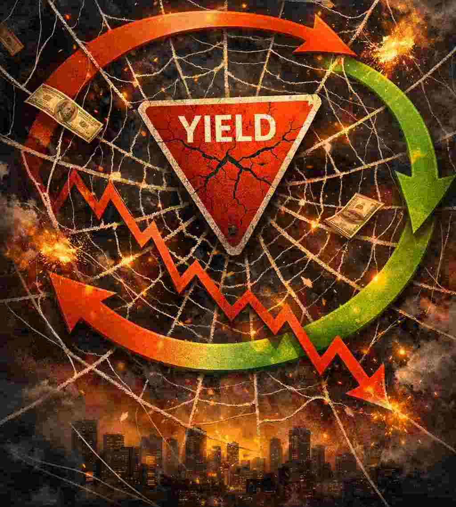

**奪命蜘蛛網**

**信心崩潰如何把債券殖利率變成失控的正回饋迴路**

::: {style="float: left; margin-right: 15px;"}
{width="400px"} 
:::

經濟學中有一個有用的蛛網模型（cobweb model），用來分析經濟週期與泡沫。在正常情況時（負回饋蛛網模型），高價格會鼓勵生產者增加供應，最終把價格拉下來。系統會出現震盪，但會逐漸穩定下來。在正回饋版本中，更高的價格預期本身就會把實際價格推得更高。蜘蛛網會越收越緊，直到崩斷。

債券市場能以驚人的速度從第一種版本轉成第二種。當投資人仍相信中央銀行最終會壓制通膨時，較高的名義殖利率會發揮煞車作用。一旦這份信任蒸發，同樣的高殖利率就會變成加速器。投資人因為懷疑央行是否有意願與能力撲滅通膨，會要求越來越高的通膨風險溢價。這些更高的殖利率被解讀為系統已經崩潰的證據，進一步推高通膨預期，令迴路自我強化。

蛛網數學模型很簡單。預期通膨可以寫成一個自迴歸過程：

$$\pi_(t+1) = \pi_t + k(\pi_t – \pi_(t-1))$$
其中 $\pi_t$ 是第 t 期的預期通膨；k 是回饋係數，衡量投資人把從 t-1 到 t 的通膨預期上升外推到未來預期的強度。

重新整理成標準二階線性齊次差分方程：

$$\pi_(t+1) – (1 + k) \pi_t + \pi_(t-1)) = 0$$
特徵方程變成：$\lambda^2 - (1 + k)\lambda + k = 0$。因式分解後得到根：$\lambda_1 = 1$，$\lambda_2 = k$。因此預期通膨隨時間的一般解為 $\pi_t = C_1(1)^t + C_2 k^t$。
若要讓名義利率出現爆炸性、連鎖式螺旋上升，第二個特徵根必須位於單位圓之外（$|\lambda_2| = k > 1$）。在這種情況下，制度性信心被摧毀，未來利率會以指數速度被推高。

市場上即將失去信心的版本，目前正全面展現在殖利率曲線上。美國長期公債殖利率已攀升至超過二十年未見的水準：十年期曾上漲至 5.2% 以上，三十年期則超過 5.6%。像 TLT 這類長期債券基金已被重創，且幾乎看不到穩固底部的跡象。日本，英國與部分歐陸國家利率也出現類似的數十年高點。

美國正面臨特別尷尬的再融資狀況。大約三分之一的美國公債會在十二個月內到期，必須以市場當下所要求的較高利率展期。外國官方買盤不再是可靠的承銷者。中國持有的美國公債已降至約 6,180 億美元 - 這是 2008 年以來最低水準，低於十多年前超過 1.3 兆美元高峰的一半。日本機構長期是穩定需求來源，但在本地殖利率上升的壓力下，正逐漸傾向購買日本國債（JGB）。

與此同時，私人部門也在發債。資本密集的人工智能與科技公司持續大量發行債券與股權連結證券，為數據中心與晶片採購融資，直接與美國公債競爭資金。

這就是經典的債務陷阱（debt-trap)失控。更高的殖利率推高政府利息支出，擴大赤字，需要發更多債，進而再推高殖利率。股市早已超買，且高度槓桿，對貼現率的持續上升的抵抗力很脆弱。股市急挫會反過來傷害資本利得稅與企業所得稅收入，進一步令政府財政惡化。

聯儲局能否像伏爾克那樣，把短期利率推高到足以壓低通膨預期的水平？1980 年整個聯邦債務還不到 1 兆美元。今天已超過 40 兆。即使在非衰退年份，年度赤字仍接近 2 兆。福利計劃與利息成本幾乎不留任何裁減空間。真正的伏爾克式利息上升會立即造成政治上無法承受的後果，這一點投資者十分明白，亦是為什麼他們對聯準會是否有意願與能力撲滅通膨失去信心的原因。

殖利率高企並非只是政府的問題。企業債、家庭房貸、信用卡餘額、學生貸款，以及龐大的私人信貸體系，全都是在「借錢會一直便宜」的假設下擴張的。利率每上升 1 個百分點，就會讓所有需要再融資的債務利息成本倍增。在 2% 時看起來可行的投資，到了 5% 或 6% 就變得岌岌可危。低息造成的錯誤投資遲早會爆破。

靠槓桿養肥的金融機構終將需要救援。歷史顯示，中央銀行會提供支援 - 互換額度、緊急機制或直接擴張資產負債表等等，因為置之不理的話就會造成系統性崩盤。一旦救援過程啟動，政策優先順序就會從控制通膨轉向保全債券市場與銀行體系穩定。

債券對那些把它們當作無風險的投資者來說，過去十年的回報已經十分悲慘。當傳統避險資產本身變成波動來源時，投資者會選擇政府無法憑空印出來的貨幣資產：黃金。

在平常時期，黃金不喜歡利率上脹，因為持有無利息收益金屬的機會成本會上升。但一旦投資者關切「資本能否拿得回來」時，一切就改變了。當投資人開始懷疑債券最終償還所用貨幣的長期購買力時，黃金就不再像對利率敏感的商品，而開始變成貨幣保險工具。

1970 年代提供了最清晰的現代例證。1971 年美元與黃金的連結被切斷後，金價從大約每盎司 35–40 美元攀升至 1980 年 1 月接近 850 美元的高峰 - 漲幅超過二十倍。同一時期，十年期公債殖利率從 1970 年代初期的約 6% 升至 1981 年十月的 15.84%。在那十年的大部分時間，尤其是後半段，殖利率與金價同步上升。當時通脹預期正失控，更高的名義利率不再是嚇阻因素，相反，它們只是貨幣體系陷入嚴重麻煩的證據。黃金在那個環境中蓬勃發展。

正回饋蛛網模型描述的是當前一個體制的穩定假設停止運作時會發生什麼事。信心是脆弱的東西。一旦開始瓦解，利率螺旋就可能自我強化。到了那個時候，印鈔就是唯一可選項。而黃金，一如既往地耐心地，靜靜地等待市場先生按下重置鍵。

這篇文章也已發佈在[我的Substack網站](https://alandharma.substack.com/)上

**免責聲明** 

本部落格所提供之內容僅供資訊與教育用途，並不構成任何財務、投資或專業建議。本人並非持牌財務顧問；文中所表達之觀點僅屬個人基於邏輯思考與一般觀察所得的意見。金融市場本質上具有高度波動性與不可預測性，過往表現並不代表未來結果。

強烈建議讀者在作出任何投資或財務決策前，應自行進行獨立研究、充分的調查分析，並諮詢合格的專業人士。透過存取及使用本部落格的資料，您即承認並同意作者對於因依賴此處所載資訊而可能導致的任何損失、損害或不利結果，概不承擔任何責任或義務。
